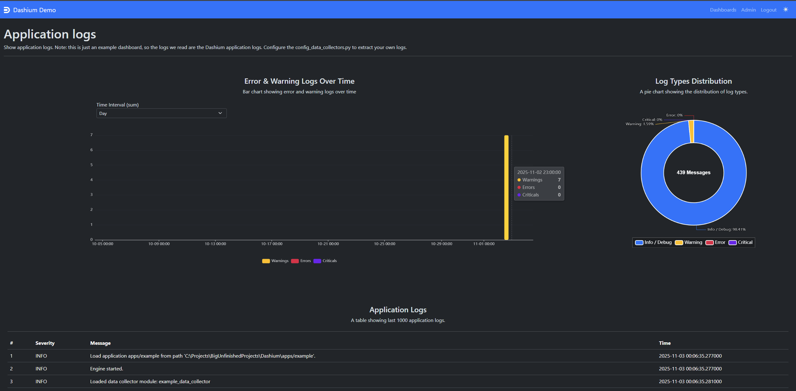
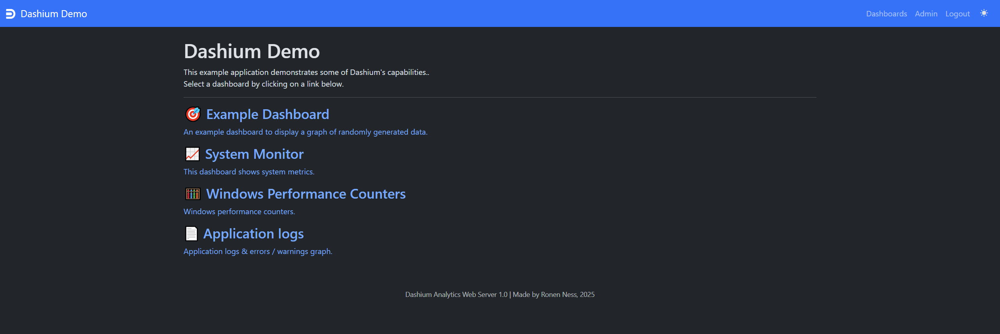
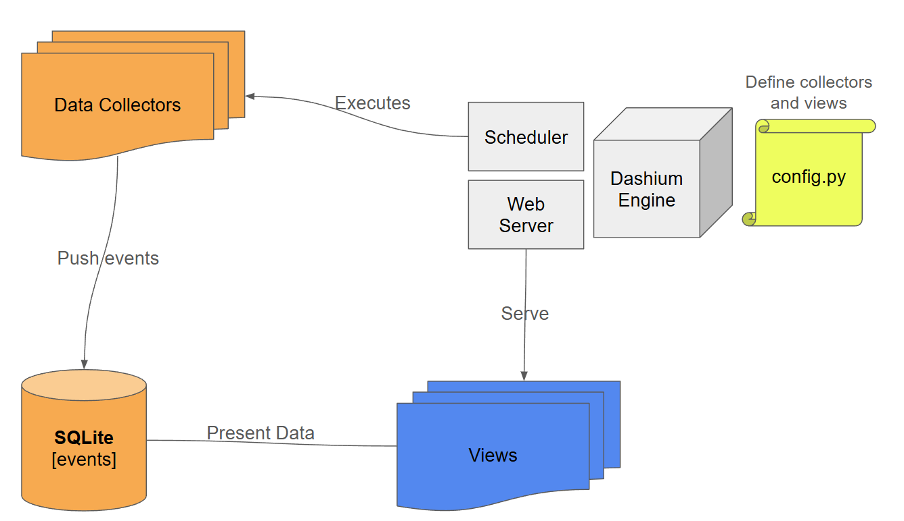

# Dashium 



# Table of Contents

- [Dashium](#dashium)
  - [How it works](#how-it-works)
  - [Why Dashium ?](#why-dashium-)
  - [Why Not Dashium ?](#why-not-dashium-)
- [Getting Started](#getting-started)
- [Dashium Architecture](#dashium-architecture)
  - [Data Collectors](#data-collectors)
  - [Views](#views)
- [Build Your Own Application](#build-your-own-application)
  - [config.py](#configpy)
- [Widgets](#widgets)
  - [Common Widget Properties](#common-widget-properties)
  - [Widget Types](#widget-types)
  - [Dashboard Configuration Structure](#dashboard-configuration-structure)
- [API Endpoints](#api-endpoints)
  - [GET /api/events](#get-apievents)
  - [POST /api/events](#post-apievents)
- [License](#license)

`Dashium` is a flexible dashboard framework for monitoring and visualizing data. 
It supports multiple widget types for displaying metrics, charts, and tables with extensive customization options.

The beauty of `Dashium` lies in its simplicity - a single, all-in-one application that covers everything end-to-end. Free, open source, and on-prem.


## How it works

`Dashium` is a lean, all-in-one Python application that covers every aspect of a data visualization platform:

- **Visualization:** Implements the frontend with commonly used chart types, powered by *Apache ECharts*.
- **Backend:** Provides a simple backend with an integrated SQLite database and authentication.
- **Data Collection:** Handles data ingestion and storage directly into the database.

In other words, while setting up other data visualization frameworks such as the **ELK stack** requires installing and configuring multiple components - **Elasticsearch**, **Logstash**, **Kibana**, and often **Metricbeat** or **Filebeat** for data collection - with `Dashium`, you don't need to install anything else.

Simply run a single Python application, and you're ready to go. Fast, easy, and with tiny footprint.

### Wait, is `Dashium` really as powerful as **ELK stack**??

Nope, not even close. `Dashium`'s strength doesn't lie in scalability or enterprise-level maturity.  
Its real power comes from its **simplicity**, **minimal resource usage**, and **blazing-fast setup** - allowing you to get a complete data visualization solution running in seconds and on-prem.

If you need a powerful solution such as **ELK stack**, go with **ELK stack**.
If you need something easy and lean, go with **Dashium **.

## Why Dashium ?

When should you use `Dashium`:

- **On-Prem Deployments:** Ideal for environments that can't rely on external services and have limited system resources.  
- **POCs, Hackathons, and Internal Tools:** Perfect for quick prototypes or small-scale projects that don't handle large datasets.  
- **Bundled Applications:** Great for shipping alongside your own software when you want to avoid requiring users to install additional services.

## Why Not Dashium ?

Main Limitations of `Dashium` are:

- **Not for Large-Scale Data:** `Dashium` is limited by what SQLite with Python can handle, so it isn't suitable for big data applications.  
- **Limited Features:** `Dashium` provides basic charts and filters that cover the most common use cases, but it's less suited for advanced data science needs.
- **No Real-Time Updates:** Dashboards are nearline and do not automatically update in real time.  

If any of these limitations are critical for your project, `Dashium` may not be the best fit for you.

# Getting Started

To start using `Dashium`, simply extract the project files to any location on your machine and ensure you have **Python 3.8** or newer installed.

You can then run any `Dashium` application using the `dashium .py` script. For example, to start the built-in example application run:

```bash
py dashium .py apps/example 
```

The example application comes with the following dashboards:

- **Example Dashboard:** Displays random data across a few sample widgets to demonstrate core functionality.  
- **System Monitor:** Shows CPU, memory, network, I/O, and other system statistics.  
  *Requires the `psutil` Python package.*  
- **Windows Performance Counters:** (Windows only) Displays a simple table of Windows performance counters.  
  *Requires the `wmi` Python package.*
- **Application Logs** Shows logs and errors / warnings over time.

By default, the example will host on `http://localhost:8080`. Once you login (with default credentials: `admin` / `admin`), you should be able to see the following dashboards selection:



Most dashboards will be empty until the data collectors start feeding some events. You can click on the admin panel (top right options) to see which collectors executed, and if any errors occured.

Keep in mind you need to install some python packages to use the example data collectors, so its best to install these packages now:

```bash
py -m pip install psutil
py -m pip install wmi
```

### What Next

Now that you have the example application running, let's take a closer look at how `Dashium` works. After that, we'll go over what you need to configure to build your own `Dashium` application

# Dashium Architecture

Now that we've covered how to install an example application and configure the basics, let's take a closer look at the different components that make up `Dashium`.



At its core, `Dashium` manages a database of **events**, where each event represents a data point to be visualized in the dashboards. Every event includes the following fields:

- **name**: A unique identifier for the event type. For example, `cpu_usage_event` can represent the percentage of CPU utilization.
- **value**: The numeric value associated with the event. For example, in `cpu_usage_event`, this would represent the CPU usage in percent.
- **tag**: An optional label used for filtering. For example, in log events, we use the tag to represent log severity.
- **additional_info**: Optional free-text metadata. For example, in log events, we use this field to store the original log message.
- **timestamp**: The time the event occurred.

Our events database is built from two main sources:

- **Data Collectors**: Scripts that run periodically (for example, every few minutes) to collect data from various sources.
- **Events API**: An API that allows applications to inject events directly into the database using HTTPS POST requests.

As we build our events database, we can start visualizing the data in our dashboards - which is the core purpose of `Dashium`.

Dashboards in `Dashium` are defined as *Views*. The `Dashium` engine processes view configurations and dynamically constructs widgets from various data sources, which are essentially queries executed against the events database.

For example, using the views configuration, we can define a dashboard that visualizes CPU usage over time.


## Data Collectors

Data Collectors are Python scripts that run as background jobs to gather data events from various sources and feed them into the Dashium database. 

They are the primary mechanism for populating your dashboards with real-time data.

### How Data Collectors Work

1. **Scheduled Execution**: Each collector runs at configurable intervals (e.g., every 1, 5, or 60 minutes)
2. **Data Gathering**: Collectors fetch data from their assigned sources (files, APIs, system metrics, etc.)
3. **Event Creation**: Raw data is converted into standardized event objects
4. **Database Storage**: Events are stored in the SQLite database for dashboard consumption

### Built-in Data Collectors

`Dashium` includes several ready-to-use data collectors in the `data_collectors/` directory:

#### cpu_usage.py

Collects CPU usage percentage

Requires: psutil
Events: cpu_usage (percentage value)

#### disk_usage.py

Monitors disk space usage

Requires: psutil
Events: disk_usage_percent, disk_usage_used_mb, disk_usage_free_mb

#### example_data_collector.py

Generates random sample data for testing

Events: example_event (random values 1-100)

#### io_operations.py

Tracks disk I/O operations per second

Requires: psutil
Events: io_operations_read_count_per_sec, io_operations_write_count_per_sec, 
io_operations_read_bytes_per_sec, io_operations_write_bytes_per_sec

#### logs_collector.py

Parses log files with timestamp and severity extraction

Events: log_message (with severity levels as tags)
Features: Persistent state tracking, multiple timestamp formats, regex patterns

#### memory_usage.py

Collects memory usage statistics

Requires: psutil
Events: memory_usage_percent, memory_usage_mb

#### network_usage.py

Monitors network I/O per second

Requires: psutil
Events: network_usage_bytes_sent_per_sec, network_usage_bytes_recv_per_sec

#### processes_count.py

Counts running processes

Requires: psutil
Events: processes_count

#### windows_counters.py

Windows performance counters (Windows only)

Requires: wmi, pythoncom
Events: perf_counters (with various counter types as tags)
data_collector_template.py - Template for creating new collectors (not functional)

### Built-in Collector Configuration Examples

#### Disk Usage Collector Configuration
```python
{
    "module": "disk_usage", 
    "collect_interval_in_minutes": 10, 
    "config": {
        "retention_days": 60,
        "path": "/",
        "collect_when_server_starts": True
    }
}
```

#### Log File Collector Configuration
```python
{
    "module": "logs_collector", 
    "collect_interval_in_minutes": 1, 
    "config": {
        "log_file_path": str(Path(__file__).parent / 'logs' / 'app.log'),
        "log_pattern": r'^[^|]*\|\s*(\d{4}-\d{2}-\d{2}\s+\d{2}:\d{2}:\d{2},\d{3})\s*\|\s*(\w+)\s*\|:\s*(.+)$',
        "timestamp_format": '%Y-%m-%d %H:%M:%S,%f',
        "retention_days": 60
    }
}
```

## Views

As previously mentioned, dashboards in `Dashium` are defined as *Views*. 

A typical `View` has two parts in it:

- **Data Sources**: list of events to query from the database, which will be presented in this view.
- **Widgets**: list of widgets that present the data sources in different ways.

For example, the following `View` configuration will define a dashboard called "Example Dashboard", which will load all events with name `example_events` from the last 10 days, and present them in a simple line graph:

```py
{
    "id": "example_data_collector", 
    "title": "Example Dashboard",
    "icon": "target",
    "inline_description": "An example dashboard to display a graph of randomly generated data.",
    "long_description": "This dashboard shows the events generated by the 'example_data_collector' on a simple line graph.", 
    "data": [
        {
            "id": "example_events", 
            "event": "example_event", 
            "max_age_days": 10, 
            "tags": None
        }
    ],
    "widgets": [
        {
            "title": "Example Data Collector Graph",
            "description": "A graph showing the events collected by the example data collector.",
            "data_sources": ["example_events"],
            "columns": 12,
            "type": "line_graph",
            "time_range_filter": True
        },
    ]
}
```

Once this configuration is added to the `VIEWS` list in your application settings, a new dashboard will be automatically generated and accessible from the home page, displaying the example events on a line chart.


# Build Your Own Application

The main file you need to edit when building a `Dashium` application is config.py. This is the file that defines your application, views, data collectors, and more.

## config.py

The `config.py` file (located in your application folder) contains all the settings for your `Dashium` application. Key configurable options include:

- **DATA_COLLECTORS:** Determines which data collectors are enabled for your application. *(More on this later.)*  
- **VIEWS:** Defines your dashboards and views. *(More on this later.)*  
- **WEB_SERVER_CONFIG:** Configures the web server that serves your dashboards. *(More on this later.)*  
- **PUSH_EVENTS_API_CONFIG**: Configure an API to submit events via POST requests. *(More on this later.)*  
- **WEB_VIEWS:** Configures your frontend, including application name, front page intro, navbar links, etc.  
- **USERS:** Sets the usernames and passwords allowed to log in.  
- **ENABLE_ADMIN_PANEL:** Set to `True` (default) to enable the admin panel, where you can view logs and raw events.  


There are many additional settings available in `config.py` that are not listed here. 
You can learn more about them by exploring the file.

### DATA_COLLECTORS

The `DATA_COLLECTORS` setting defines which **Data Collectors** are enabled for your application.  

For example, the following will enable an example data collector that generate random events:

```py
{
    "module": "example_data_collector",  # name of the collector script under data_collectors/.
    "collect_interval_in_minutes": 1,    # how often to execute the collector.
    "config": {}                         # additional config, passed to the collector. every collector has its own options.
}
```

There are several basic built-in collectors located in the root `data_collectors/` folder.  
You can also create your own collector scripts and place them in the `data_collectors/` directory of your application.

To define your own data collector, use the template file `data_collectors/data_collector_template.py`.

#### config_data_collectors.py

In the example application's `config.py`, you'll notice that the `DATA_COLLECTORS` list is empty.  
This is because the actual collector configuration is stored in a separate file, `config_data_collectors.py`.  

Keeping the configuration in a separate file is purely for convenience, helping to keep `config.py` shorter and easier to manage.

### VIEWS

The `VIEWS` setting is the main configuration that defines all dashboards and views in your application.
Every `view` is a dashboard, which contains data sources to load and widgets to display them.

For example, the following will define a very basic view with example lines graph:

```py
{
    "id": "example_data_collector",     # id of the view
    "title": "Example Dashboard",       # view title
    "icon": "target",                   # icon to display in main page
    "inline_description": "Short description that will appear in main page.",
    "long_description": "Longer description that will appear in the view itself.", 
    "data": [ 
        {
            # define which events to load for this view
            "id": "example_events", 
            "event": "example_event", 
            "max_age_days": 10, 
            "tags": None
        }
    ],
    # define widgets to display the data
    "widgets": [
        # example widget: lines graph on the example_events data source
        {
            "title": "Example Data Collector Graph",
            "description": "A graph showing the events collected by the example data collector.",
            "data_sources": ["example_events"],
            "columns": 12,
            "type": "line_graph",
            "time_range_filter": True
        }
    ]
}
```


#### config_views.py

In the example application's `config.py`, you'll notice that the `VIEWS` list is empty.  
This is because the actual collector configuration is stored in a separate file, `config_views.py`.  

Keeping the configuration in a separate file is purely for convenience, helping to keep `config.py` shorter and easier to manage.


### WEB_SERVER_CONFIG

The following are the main configuration keys you can set under `WEB_SERVER_CONFIG`: 

**Basic Server Settings**

| Setting | Type | Default | Description |
|---------|------|---------|-------------|
| `host` | string | `"127.0.0.1"` | IP address to bind the web server to |
| `port` | integer | `8080` | Port number for HTTP connections |
| `enable_https` | boolean | `False` | Enable HTTPS/SSL instead of HTTP |
| `https_port` | integer | `8443` | Port number for HTTPS connections when SSL is enabled |

**SSL/TLS Certificate Settings**

| Setting | Type | Default | Description |
|---------|------|---------|-------------|
| `ssl_cert_file` | string | `None` | Path to SSL certificate file (.pem or .crt) |
| `ssl_key_file` | string | `None` | Path to SSL private key file (.key) |
| `ssl_cert_chain_file` | string | `None` | Path to certificate chain file (optional) |
| `ssl_check_hostname` | boolean | `True` | Whether to verify SSL hostname matches certificate |
| `ssl_verify_mode` | string | `"CERT_REQUIRED"` | SSL verification mode: CERT_NONE, CERT_OPTIONAL, CERT_REQUIRED |

**Authentication Settings**

| Setting | Type | Default | Description |
|---------|------|---------|-------------|
| `username` | string | `"admin"` | Username for web interface login |
| `password` | string | `"admin"` | Password for web interface login |
| `session_timeout_minutes` | integer | `60` | How long user sessions remain active |

**SSL Verification Mode Options**

- `CERT_NONE` - No certificate verification (insecure, development only)
- `CERT_OPTIONAL` - Certificate verified if present
- `CERT_REQUIRED` - Certificate must be present and valid

### PUSH_EVENTS_API_CONFIG

The following configuration options are available under `PUSH_EVENTS_API_CONFIG` for managing posting events API endpoint:

| Setting | Type | Default | Description |
|---------|------|---------|-------------|
| `enable` | boolean | `False` | Enable the POST API endpoint for adding events |
| `api_key` | string | `"your-secret-api-key-here"` | API key required for POST events endpoint authentication |
| `url` | string | `"/api/events"` | URL path for the POST events endpoint |

**Security Note:** Always change the default API key to a secure, randomly generated string before deploying to production.


# Widgets

Now that we've covered the core concepts of `Dashium`, let's dive a little deeper into the different widgets that can be displayed within the views:

## Common Widget Properties

Every widget accept the following configurations:

### Basic Properties

- **`title`** (string): Widget display title
- **`description`** (string): Widget description/subtitle  
- **`type`** (string): Widget type (see types above)
- **`columns`** (integer): Width in Bootstrap columns (1-12)
- **`height`** (float): Height multiplier (0.0-2.0, where 1.0 = 600px)
- **`data_sources`** (array): Data source IDs or objects with tags

### Data Source Formats

The data sources setting define which data sources to assign to this widget. This is a critical setting we must add to every widget, as it define what we actually show in it.

```python
# Simple string format
"data_sources": ["cpu_usage"]

# Object format with tag filtering  
"data_sources": [
    {"id": "log_message", "tags": ["ERROR", "CRITICAL"]},
    {"id": "cpu_usage", "tags": null}
]
```

Data sources can have the following properties:

- **id** [required]: the unique identifier of the data source to display in widget.
- **tags** [optional]: tags to include. any event with `tag` that don't match any of these values, will be ignored.
- **mutators** [optional]: list of mutators to apply on the value before presenting it. every value is an object with {operation, value}, where operations include the following options: `add, subtract, multiply, divide, round, floor, ceil, absolute, remove_negatives, to_delta, to_percentage_change`.
- **additional_info_filter** [optional]: list of additional_info values to include. any event with `additional_info` that don't match any of these values, will be ignored.

### Time Aggregation

Available for line graphs, bar graphs, and gauges, and define how we want to aggregate events based on intervals:

```python
"time_aggregation": {
    "starting_value": "hour",        # Default interval
    "allow_selection": True,         # Show dropdown selector
    "aggregation_function": "average" # How to aggregate data points
}
```

**Interval Options:**
- `"disabled"` - No aggregation (raw data)
- `"page_default"` - Use dashboard default
- `"10m"` - 10 minutes
- `"30m"` - 30 minutes  
- `"hour"` - 1 hour
- `"day"` - 1 day
- `"week"` - 1 week

**Aggregation Functions:**
- `"average"` / `"average_round"` - Average values
- `"sum"` - Sum values
- `"max"` - Maximum value
- `"min"` - Minimum value

### Color Options

Colors can be specified as:
- **Named colors**: `"primary"`, `"secondary"`, `"success"`, `"danger"`, `"warning"`, `"info"`, `"special"`
- **Hex colors**: `"#ff0000"`, `"#0066cc"`
- **Color indexes**: `0`, `1`, `2` (maps to default color palette)

### Time Range Filtering

Add `"time_range_filter": true` to enable dashboard-wide time filtering for the widget.

## Widget Types


### 1. Gauge Widget

Displays a single metric value as a gauge (speedometer-style) with customizable ranges and colors.

**Configuration:**
```python
{
    "title": "CPU Usage Health",
    "description": "Last measurement CPU utilization",
    "data_sources": ["cpu_usage"],
    "type": "gauge",
    "aggregation_type": "last",  # "last", "first", "average", "sum", "max", "min"
    "columns": 4,
    "height": 0.7,
    "show_last_value_time": True,
    "style": {
        "min": 0,                    # Minimum gauge value
        "max": 100,                  # Maximum gauge value
        "gauge_color": "primary",    # Base gauge color
        "value_formatter": "{value}%", # Value display format
        "axis_colors": [             # Color zones [percentage, color]
            [0.3, "#67e0e3"],        # 0-30%: light blue
            [0.7, "#37a2da"],        # 30-70%: blue  
            [1, "#fd666d"]           # 70-100%: red
        ],
        "show_progress": True,       # Show progress fill
        "progress_opacity": 0.8,     # Progress fill opacity
        "radius": "75%",            # Gauge size
        "label": "CPU %",           # Label text
        "split_number": 10,         # Number of scale divisions
        "center": ["50%", "55%"],   # Gauge center position
        "start_angle": 225,         # Starting angle (degrees)
        "end_angle": -45,           # Ending angle (degrees)
        "clockwise": True,          # Clockwise direction
        "value_size": 30,           # Value text size
        "value_offset": [0, "70%"], # Value text position offset
        "show_title": True,         # Show title text
        "title_size": 14,           # Title text size
        "title_offset": [0, "90%"], # Title text position offset
        "pointer_length": "60%",    # Pointer length
        "pointer_width": 6,         # Pointer width
        "axis_width": 30,           # Axis line thickness
        "tick_distance": -45,       # Tick marks distance from center
        "tick_length": 8,           # Tick marks length
        "split_distance": -52,      # Major tick distance from center
        "split_length": 14,         # Major tick length
        "label_distance": -20,      # Label distance from center
        "label_size": 12,           # Label text size
        "show_anchor": True,        # Show center anchor
        "anchor_size": 25,          # Anchor size
        "anchor_border_width": 10   # Anchor border width
    }
}
```

### 2. Line Graph Widget

Displays time-series data as connected lines with optional area fill and multiple series support.

**Configuration:**
```python
{
    "title": "CPU Usage Over Time",
    "description": "A graph showing CPU usage trends",
    "data_sources": ["cpu_usage"],
    "type": "line_graph",
    "columns": 6,
    "height": 1.0,
    "values_suffix": "%",
    "time_aggregation": {
        "starting_value": "page_default",  # "disabled", "10m", "30m", "hour", "day", "week"
        "allow_selection": True,           # Show time aggregation dropdown
        "aggregation_function": "average_round"  # "average", "sum", "max", "min"
    },
    "style": {
        "lines_smooth": False,      # Smooth curves vs straight lines
        "area_fill": True,          # Fill area under line
        "lines_color": 0,           # Color index or hex color
        "lines_width": 2,           # Line thickness
        "lines_type": "solid",      # "solid", "dashed", "dotted"
        "area_opacity": 0.25,       # Area fill opacity (0.0-1.0)
        "label": "CPU Usage",       # Series label
        "item_border_color": "#fff", # Point border color
        "item_border_width": 0,     # Point border width
        "markline": {               # Reference line (optional)
            "value_y": 80,          # Y-axis value for line
            "style": "dashed",      # Line style
            "color": "red",         # Line color
            "label": "Threshold"    # Line label
        }
    },
    "time_range_filter": True       # Show time range filter
}
```

### 3. Bar Graph Widget

Displays time-series data as bars, ideal for discrete events or counts.

**Configuration:**
```python
{
    "title": "Log Messages by Type",
    "description": "Bar chart showing log message counts",
    "data_sources": [
        {"id": "log_message", "tags": ["INFO", "DEBUG"]},
        {"id": "log_message", "tags": ["WARNING"]},
        {"id": "log_message", "tags": ["ERROR"]}
    ],
    "type": "bar_graph",
    "columns": 12,
    "height": 1.0,
    "style": [
        {
            "bar_color": "primary",    # Bar color
            "bar_width": "30%",        # Individual bar width
            "bar_gap": "20%",          # Gap between bars of same category
            "bar_category_gap": "20%", # Gap between categories
            "label": "Info/Debug",     # Series label
            "border_radius": 4,        # Bar corner radius
            "item_border_color": "#fff", # Bar border color
            "item_border_width": 0     # Bar border width
        },
        {
            "bar_color": "warning",
            "bar_width": "30%",
            "label": "Warnings",
            "border_radius": 4
        },
        {
            "bar_color": "danger",
            "bar_width": "30%",
            "label": "Errors",
            "border_radius": 4
        }
    ],
    "time_aggregation": {
        "starting_value": "day",
        "allow_selection": True,
        "aggregation_function": "sum"
    }
}
```

### 4. Pie Chart Widget

Displays proportional data as pie slices, with optional donut mode and center text.

**Configuration:**
```python
{
    "title": "Log Types Distribution",
    "description": "Pie chart showing log type proportions",
    "data_sources": [
        {"id": "log_message", "tags": ["INFO", "DEBUG"]},
        {"id": "log_message", "tags": ["WARNING"]},
        {"id": "log_message", "tags": ["ERROR"]},
        {"id": "log_message", "tags": ["CRITICAL"]}
    ],
    "type": "pie_chart",
    "columns": 6,
    "height": 0.8,
    "style": {
        "aggregation_type": "sum",          # How to aggregate data
        "radius": "70%",                    # Pie size (or outer radius for donut)
        "donut": False,                     # Enable donut mode
        "inner_radius": "20%",              # Inner radius for donut mode
        "outer_radius": "70%",              # Outer radius for donut mode
        "center": ["50%", "50%"],           # Pie center position
        "show_legend": True,                # Show legend
        "labels": ["Info/Debug", "Warning", "Error", "Critical"],
        "legend_position": "bottom",        # Legend position
        "legend_orient": "horizontal",      # Legend orientation
        "colors": ["primary", "warning", "danger", "special"], # Slice colors
        "label_formatter": "{b}: {d}%",     # Label format
        "label_position": "outside",        # Label position
        "show_labels": True,                # Show slice labels
        "show_label_lines": True,           # Show label connecting lines
        "border_width": 2,                  # Slice border width
        "border_color": "#fff",             # Slice border color
        "show_center_text": False,          # Show center text (donut only)
        "center_text_formatter": "Total: {total}", # Center text format
        "center_text_size": 24,             # Center text font size
        "center_text_color": "#000000"      # Center text color
    },
    "time_range_filter": True
}
```

### 5. Counter Widget

Displays a single aggregated number prominently.

**Configuration:**
```python
{
    "title": "Total Processes",
    "description": "Current number of running processes",
    "data_sources": ["processes_count"],
    "type": "counter",
    "counter_type": "last",  # other options: "last", "first", "average", "average_round", "sum", "max", "min", "count", "first_datetime", "last_datetime", "diff_last_first", "diff_max_min"
    "columns": 3,
    "height": 0.2,
    "time_range_filter": True
}
```

### 6. Table Widget

Displays tabular data with optional sorting, coloring, and pagination.

**Configuration:**
```python
{
    "title": "Recent Log Entries",
    "description": "Table of recent application logs",
    "data_sources": ["log_message"],
    "type": "table",
    "columns": 12,
    "height": 0,                # Auto height
    "max_rows": 1000,           # Maximum rows to display
    "slice_from": "end",        # "start" or "end" - where to slice data
    "table_columns": [
        {"title": "#", "event_field": "index"},
        {"title": "Severity", "event_field": "tag"},
        {"title": "Message", "event_field": "additional_info"},
        {"title": "Time", "event_field": "time"}
    ],
    "color_rules": [            # Conditional row coloring
        {"event_field": "tag", "condition": "equals", "value": "DEBUG", "color": "secondary"},
        {"event_field": "tag", "condition": "equals", "value": "WARNING", "color": "warning"},
        {"event_field": "tag", "condition": "equals", "value": "ERROR", "color": "danger"},
        {"event_field": "tag", "condition": "equals", "value": "CRITICAL", "color": "danger fw-bold"}
    ],
    "time_range_filter": True
}
```

**Available event_field values:**
- `"value"` - Event value
- `"tag"` - Event tag
- `"time"` - Event timestamp
- `"additional_info"` - Additional event information
- `"event_name"` - Event name
- `"index"` - Row index

**Available condition values:**
- `"equals"` - Exact match
- `"not_equals"` - Not equal to
- `"contains"` - Contains substring
- `"greater_than"` - Numeric greater than
- `"less_than"` - Numeric less than

### 7. Scatter Map Widget

Displays data points as a scatter plot, useful for correlation analysis.

**Configuration:**
```python
{
    "title": "CPU vs Memory Usage",
    "description": "Scatter plot showing correlation between CPU and Memory",
    "data_sources": ["cpu_usage", "memory_usage_percent"],
    "type": "scatter_map",
    "columns": 12,
    "height": 1.0,
    "x_axis_name": "CPU Usage (%)",
    "y_axis_name": "Memory Usage (%)",
    "values_suffix_x": "%",
    "values_suffix_y": "%",
    "enable_zoom": True,        # Enable chart zooming
    "style": {
        "aggregation_type": "avg",   # Data aggregation method
        "symbol_size": 6,            # Point size
        "symbol": "circle",          # Point shape: "circle", "rect", "triangle", etc.
        "color": "primary",          # Point color
        "border_color": "#fff",      # Point border color
        "border_width": 0,           # Point border width
        "opacity": 0.8,              # Point opacity
        "emphasis_border_color": "#333", # Border color on hover
        "emphasis_border_width": 2,  # Border width on hover
        "label": "Data Points"       # Series label
    }
}
```

### 8. HTML Box Widget

Displays custom HTML content directly in the dashboard.

**Configuration:**
```python
{
    "title": "Custom Content",
    "description": "Custom HTML widget",
    "type": "html_box",
    "columns": 6,
    "height": 0.5,
    "html_content": "<h3>Custom HTML</h3><p>Any HTML content can go here.</p>"
}
```

## Dashboard Configuration Structure

```python
VIEWS = [
    {
        "id": "dashboard_id",
        "title": "Dashboard Title", 
        "icon": "dashboard",
        "long_description": "Detailed dashboard description",
        "inline_description": "Brief description",
        "default_time_aggregation": "30m",
        "show_page_time_aggregation_selection": True,
        "data": [
            {
                "id": "data_source_id",
                "event": "event_name_in_database", 
                "max_age_days": 14,
                "tags": None,
                "last_unique_by_tag": False
            }
        ],
        "widgets": [
            # Widget configurations go here
        ]
    }
]
```

# API Endpoints

`Dashium` provides RESTful API endpoints for accessing and submitting data.

## GET /api/events

Retrieve events from the database with optional filtering parameters.

**Authentication:** Requires web interface login (cookies/session)

**Query Parameters:**
- `name` (required): Name of the events to fetch
- `tag` (optional): Filter by specific tag
- `max_age_days` (optional): Only return events from the last N days
- `max_results` (optional): Limit the number of results returned
- `last_unique_by_tag` (optional): If "true", returns only the most recent event for each unique tag

**Example:**
```bash
curl "http://localhost:8080/api/events?name=cpu_usage&max_age_days=7&max_results=100"
```

## POST /api/events

Submit new events to the database. This endpoint requires API key authentication and must be enabled in configuration.

**Authentication:** API Key required in header
- `X-API-Key: your-api-key` OR
- `Authorization: Bearer your-api-key`

**Request Body:**
```json
{
  "events": [
    {
      "name": "event_name",                 // Required: string
      "value": 123,                         // Optional: number (default: 0)
      "tag": "category",                    // Optional: string
      "additional_info": "details",         // Optional: string
      "timestamp": "2025-01-01T12:00:00Z"   // Optional: ISO 8601 format
    }
  ]
}
```

**Example:**
```bash
curl -X POST "http://localhost:8080/api/events" \
  -H "Content-Type: application/json" \
  -H "X-API-Key: your-secret-api-key-here" \
  -d '{
    "events": [
      {
        "name": "user_login",
        "value": 1,
        "tag": "authentication",
        "additional_info": "Successful login from web interface"
      }
    ]
  }'
```

**Configuration:**

To use the POST events endpoint, you need to enable it in `config.py`:

```python
PUSH_EVENTS_API_CONFIG = {
    "enable": True,
    "api_key": "your-secure-random-api-key",
    "url": "/api/events"
}
```

# Changelist

## 1.0.1

- Added data source mutators.
- Added data source additional info filter.
- Improved logs data collector.
- 

# License

`Dashium` is free to use under the MIT license.